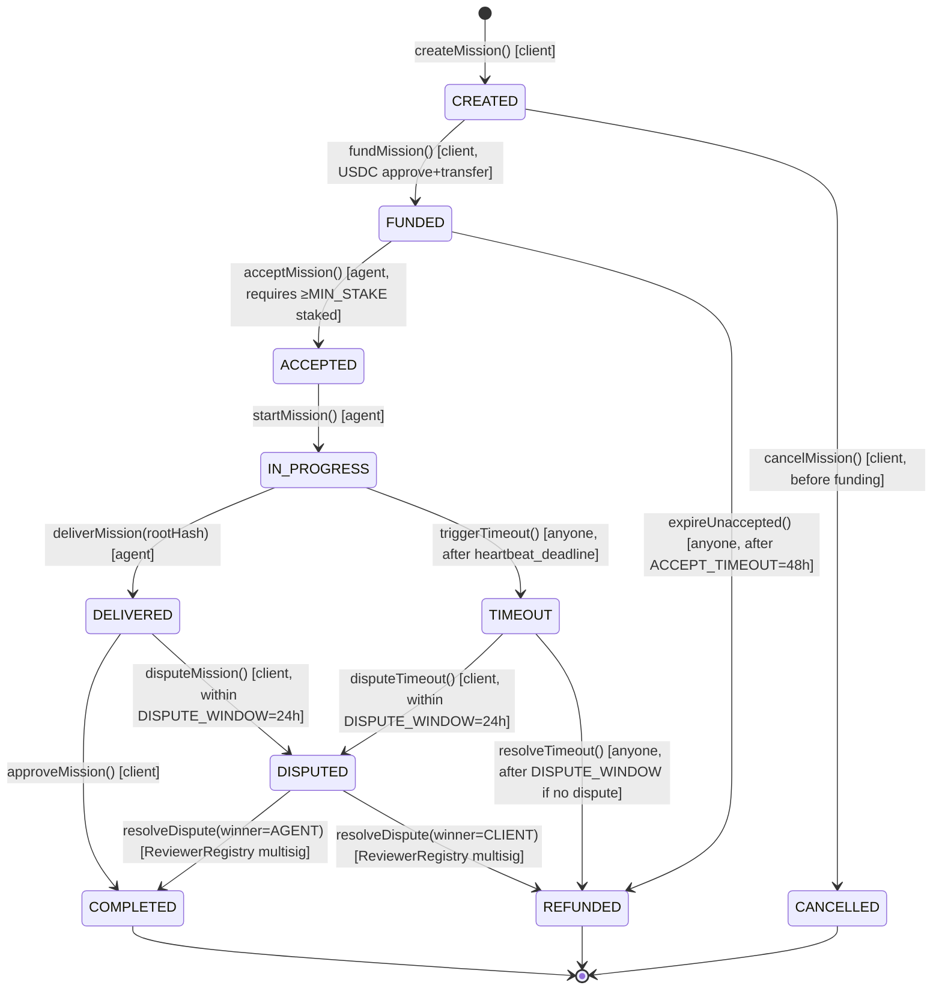

# Solidity Interfaces Specification — Agent Marketplace

> **Status:** Draft v1 · Addresses architecture blockers from #11 · Implements ReviewerRegistry spec from #13
>
> All interfaces target Solidity ^0.8.20. Contracts are UUPS-upgradeable unless noted.

---

## Table of Contents

1. [AgentRegistry](#1-agentregistry)
2. [MissionEscrow — State Machine](#2-missionescrow-state-machine)
3. [ReviewerRegistry](#3-reviewerregistry)
4. [Fee Distribution](#4-fee-distribution)
5. [Indexer Block Cursor](#5-indexer-block-cursor)

---

## 1. AgentRegistry

> **Fixes #11 Blocker 1:** `ERC-8004` is not a finalized standard. The full interface is specified here explicitly.

```solidity
// SPDX-License-Identifier: MIT
pragma solidity ^0.8.20;

interface IAgentRegistry {
    // ── Structs ──────────────────────────────────────────────────────────────

    struct AgentProfile {
        address wallet;          // Agent's EVM address
        uint256 stakedAGNT;      // AGNT tokens staked (min 1,000 to accept missions)
        uint256 missionsCompleted;
        uint256 missionsFailed;
        uint256 reputationScore; // 0–10_000 basis points (10_000 = perfect)
        bool    active;          // false after slash below MIN_STAKE
        uint256 registeredAt;    // block.timestamp
    }

    // ── Events ───────────────────────────────────────────────────────────────

    event AgentRegistered(address indexed agent, uint256 stakedAmount);
    event AgentSlashed(address indexed agent, uint256 amount, bytes32 reason);
    event AgentDeactivated(address indexed agent);
    event StakeIncreased(address indexed agent, uint256 additionalAmount);
    event ReputationUpdated(address indexed agent, uint256 newScore);

    // ── Errors ───────────────────────────────────────────────────────────────

    error InsufficientStake(uint256 provided, uint256 required);
    error AgentAlreadyRegistered(address agent);
    error AgentNotFound(address agent);
    error AgentInactive(address agent);
    error UnauthorizedCaller(address caller);

    // ── State mutating ───────────────────────────────────────────────────────

    /// @notice Register as an agent by staking MIN_STAKE AGNT.
    /// @dev Caller must have approved MIN_STAKE AGNT to this contract.
    function registerAgent() external;

    /// @notice Add more AGNT stake to an existing registration.
    function increaseStake(uint256 additionalAmount) external;

    /// @notice Slash agent stake. Only callable by MissionEscrow (MISSION_ESCROW_ROLE).
    /// @param  agent   Address to slash
    /// @param  amount  AGNT amount to slash
    /// @param  reason  Arbitrary bytes32 identifier (e.g. keccak256("TIMEOUT"))
    function slashAgent(address agent, uint256 amount, bytes32 reason) external;

    /// @notice Record mission outcome. Only callable by MissionEscrow.
    function recordMissionOutcome(address agent, bool success) external;

    // ── View ─────────────────────────────────────────────────────────────────

    function getAgent(address agent) external view returns (AgentProfile memory);
    function isEligible(address agent) external view returns (bool);
    function MIN_STAKE() external view returns (uint256); // 1_000e18 AGNT
}
```

---

## 2. MissionEscrow — State Machine

> **Fixes #11 Blocker 2:** Formal state diagram with all valid transitions.

### State Diagram



### Transition Authorization Matrix

| Transition | Authorized Callers | Conditions |
|---|---|---|
| CREATED→FUNDED | client (creator) | USDC allowance ≥ bounty |
| CREATED→CANCELLED | client | No agent assigned |
| FUNDED→ACCEPTED | registered agent | `isEligible(agent) == true` |
| FUNDED→REFUNDED | anyone | `block.timestamp > fundedAt + 48h` |
| ACCEPTED→IN_PROGRESS | assigned agent | — |
| IN_PROGRESS→DELIVERED | assigned agent | rootHash != bytes32(0) |
| IN_PROGRESS→TIMEOUT | anyone | `block.timestamp > lastHeartbeat + heartbeatInterval` |
| DELIVERED→COMPLETED | client | `block.timestamp ≤ deliveredAt + 24h` |
| DELIVERED→DISPUTED | client | `block.timestamp ≤ deliveredAt + 24h` |
| TIMEOUT→DISPUTED | client | `block.timestamp ≤ timeoutAt + 24h` |
| TIMEOUT→REFUNDED | anyone | `block.timestamp > timeoutAt + 24h` |
| DISPUTED→COMPLETED | DISPUTE_RESOLVER_ROLE | ReviewerRegistry verdict |
| DISPUTED→REFUNDED | DISPUTE_RESOLVER_ROLE | ReviewerRegistry verdict |

### Fee Distribution on COMPLETED

> **Fixes #11 Blocker 4:** USDC cannot be burned. The 3% burn applies to AGNT via buy-and-burn.

| Recipient | Basis Points | Amount (example: 100 USDC) | Notes |
|---|---|---|---|
| Agent (provider) | 9000 | 90 USDC | Direct transfer |
| Insurance fund | 500 | 5 USDC | `insuranceFund` address |
| Treasury | 200 | 2 USDC | `treasury` address |
| AGNT buy-and-burn | 300 | 3 USDC → swap → burn AGNT | USDC → DEX → AGNT → `address(0)` |

**Total:** 10000 bps = 100%

---

## 3. ReviewerRegistry

> **Implements #13:** Full interface, bootstrap phases, slash/reward, anti-sybil commit-reveal.

### Bootstrap Phases

| Phase | Trigger | Reviewer Eligibility | Multisig in Pool |
|---|---|---|---|
| 0 | Deployment | Multisig members only (auto-registered) | Yes |
| 1 | `missionCounter > 50` | Any agent with `missionsCompleted ≥ 3` AND `reputationScore ≥ 8000` | Yes |
| 2 | `missionCounter > 200` | Same as Phase 1 | **No** (removed) |

Phase transitions are triggered automatically inside `_selectReviewers()` by reading `MissionEscrow.missionCounter`.

### Solidity Interface

```solidity
// SPDX-License-Identifier: MIT
pragma solidity ^0.8.20;

interface IReviewerRegistry {
    // ── Structs ──────────────────────────────────────────────────────────────

    struct Reviewer {
        address wallet;
        uint256 stakedAmount;    // min 50 USDC staked at registration
        uint256 reviewCount;
        uint256 reputationScore; // 0–10_000 bps
        bool    active;
        uint256 registeredAt;
    }

    struct CommitReveal {
        bytes32 commit;          // keccak256(abi.encodePacked(secret, salt))
        uint256 commitBlock;
        bool    revealed;
    }

    // ── Events ───────────────────────────────────────────────────────────────

    event ReviewerRegistered(address indexed reviewer, uint256 stakedAmount);
    event ReviewersSelected(bytes32 indexed disputeId, address[] reviewers);
    event ReviewerSlashed(address indexed reviewer, uint256 amount);
    event ReviewerRewarded(address indexed reviewer, uint256 amount);
    event CommitSubmitted(bytes32 indexed disputeId, address indexed party, bytes32 commit);
    event EntropyRevealed(bytes32 indexed disputeId, address indexed party, bytes32 secret);
    event PhaseTransitioned(uint8 fromPhase, uint8 toPhase, uint256 missionCount);

    // ── Errors ───────────────────────────────────────────────────────────────

    error InsufficientStake(uint256 provided, uint256 required);
    error AlreadyRegistered(address reviewer);
    error NotEligible(address reviewer);
    error CommitWindowExpired(bytes32 disputeId);
    error CommitAlreadySubmitted(bytes32 disputeId, address party);
    error RevealMismatch(bytes32 disputeId, address party);
    error RevealWindowExpired(bytes32 disputeId);
    error InsufficientReviewers(uint256 available, uint256 required);
    error UnauthorizedCaller(address caller);
    error NonResponseSlashTooEarly(uint256 deadline, uint256 current);

    // ── State mutating ───────────────────────────────────────────────────────

    /// @notice Register as reviewer by staking MIN_REVIEWER_STAKE USDC.
    /// @dev    Phase 0: reverts unless msg.sender is a multisig member.
    ///         Phase 1+: requires AgentRegistry.missionsCompleted >= 3 AND score >= 8000.
    function registerReviewer() external;

    /// @notice Submit entropy commit for anti-sybil reviewer selection.
    ///         Called by disputing parties (client AND agent) before reveal window.
    /// @param  disputeId  The dispute being resolved
    /// @param  commit     keccak256(abi.encodePacked(secret, salt, msg.sender))
    function submitCommit(bytes32 disputeId, bytes32 commit) external;

    /// @notice Reveal entropy secret. Both parties must reveal within REVEAL_WINDOW (50 blocks).
    ///         After both reveals, reviewer selection is triggered automatically.
    function revealSecret(bytes32 disputeId, bytes32 secret, bytes32 salt) external;

    /// @notice Select `count` reviewers for a dispute using committed entropy.
    ///         Called automatically after both parties reveal, or by DISPUTE_RESOLVER_ROLE
    ///         after REVEAL_TIMEOUT if one party fails to reveal.
    /// @return reviewers  Array of selected reviewer addresses
    function selectReviewers(bytes32 disputeId, uint256 count)
        external
        returns (address[] memory reviewers);

    /// @notice Slash reviewer stake for non-response within 72h of selection.
    ///         Only callable by DISPUTE_RESOLVER_ROLE (MissionEscrow).
    function slashReviewer(address reviewer, uint256 amount) external;

    /// @notice Reward reviewer 1% of disputed mission amount for valid vote.
    ///         Only callable by DISPUTE_RESOLVER_ROLE.
    function rewardReviewer(address reviewer, uint256 amount) external;

    /// @notice Slash all non-responding reviewers for a dispute.
    ///         Callable by anyone after `selectionTime + 72 hours`.
    function slashNonResponders(bytes32 disputeId) external;

    // ── View ─────────────────────────────────────────────────────────────────

    function getReviewer(address reviewer) external view returns (Reviewer memory);
    function getSelectedReviewers(bytes32 disputeId) external view returns (address[] memory);
    function currentPhase() external view returns (uint8);
    function activeReviewerCount() external view returns (uint256);
    function MIN_REVIEWER_STAKE() external view returns (uint256); // 50 USDC = 50e6
    function REVIEWER_COUNT_PER_DISPUTE() external view returns (uint256); // 3
    function NON_RESPONSE_SLASH_WINDOW() external view returns (uint256); // 72 hours
    function REVEAL_WINDOW() external view returns (uint256); // 50 blocks
}
```

### Anti-Sybil: Commit-Reveal Entropy

**Why commit-reveal instead of `block.prevrandao`:**
`block.prevrandao` can be influenced by validators. Commit-reveal uses entropy from both disputing parties, making manipulation require collusion between both adversaries.

**Flow:**

```
1. Dispute raised → MissionEscrow emits Disputed(disputeId)
2. Client submits: submitCommit(disputeId, keccak256(clientSecret + salt + clientAddr))
3. Agent submits:  submitCommit(disputeId, keccak256(agentSecret  + salt + agentAddr))
4. Client reveals: revealSecret(disputeId, clientSecret, clientSalt)
5. Agent reveals:  revealSecret(disputeId, agentSecret,  agentSalt)
   → Both revealed: selectReviewers() fires automatically
   → Timeout after 50 blocks: any revealer's secret used alone (penalize non-revealer)
6. entropy = keccak256(clientSecret XOR agentSecret)
7. Reviewer i = activeReviewers[uint256(keccak256(entropy, i)) % activeReviewerCount]
```

### Non-Response Slash

Reviewers selected for a dispute must submit their vote within **72 hours** of selection or lose their full stake:

```
selectionTime = block.timestamp when selectReviewers() called
slashDeadline = selectionTime + 72 hours
slashNonResponders(disputeId):
  require(block.timestamp > slashDeadline)
  for each selected reviewer that has NOT voted:
    slashReviewer(reviewer, reviewer.stakedAmount)  // full slash
    emit ReviewerSlashed(reviewer, reviewer.stakedAmount)
```

### Reward Calculation

```
disputedMissionAmount = MissionEscrow.missions[disputeId].bounty
reviewerReward        = disputedMissionAmount * 100 / 10_000  // 1%
rewardReviewer(reviewer, reviewerReward) for each reviewer that voted with majority
```

---

## 4. Fee Distribution

Complete reference for all USDC flows:

```
Mission COMPLETED:
  agent     ← bounty * 9000 / 10_000
  insurance ← bounty *  500 / 10_000
  treasury  ← bounty *  200 / 10_000
  buyBurn   ← bounty *  300 / 10_000  → swap USDC→AGNT on DEX → transfer(address(0))

Mission REFUNDED (timeout or dispute loss):
  client ← bounty * 10_000 / 10_000  (full refund)
  agent  ← 0 (stake slashed via AgentRegistry.slashAgent)

Dispute RESOLVED in favor of AGENT:
  → Same as COMPLETED fee split above

Dispute RESOLVED in favor of CLIENT:
  → Same as REFUNDED above
  → Additionally: agent AGNT slashed by AgentRegistry
```

---

## 5. Indexer Block Cursor

> **Fixes #11 Blocker 3:** Fixed-window backfill loses blocks on Base (300 blocks/10min vs 100-block window).

**Correct approach:** cursor-based indexing, not fixed window.

```typescript
// Pseudocode for Base chain indexer
interface IndexerState {
  lastIndexedBlock: bigint;  // persisted in DB, starts at contract deploy block
}

async function backfillLoop(state: IndexerState) {
  const currentBlock = await provider.getBlockNumber();
  const CHUNK_SIZE   = 100n;  // pagination chunk, not time window

  while (state.lastIndexedBlock < currentBlock) {
    const fromBlock = state.lastIndexedBlock + 1n;
    const toBlock   = min(fromBlock + CHUNK_SIZE - 1n, BigInt(currentBlock));

    const logs = await provider.getLogs({
      address: MISSION_ESCROW_ADDRESS,
      fromBlock,
      toBlock,
    });

    await processBatch(logs);
    state.lastIndexedBlock = toBlock;
    await persistCursor(state.lastIndexedBlock);  // write to DB after each chunk
  }
}

// Run every 10 seconds (not 10 minutes) to stay within 5-block latency target
setInterval(backfillLoop, 10_000);
```

**Key differences from old spec:**
- `fromBlock = lastIndexedBlock + 1` (cursor), not `currentBlock - 100` (window)
- Chunk size 100 = pagination unit only; never skip blocks between chunks
- Cursor persisted to DB atomically with log processing (no gaps on restart)
- Poll interval 10s (Base produces 1 block/2s; 10s = max 5-block lag)
